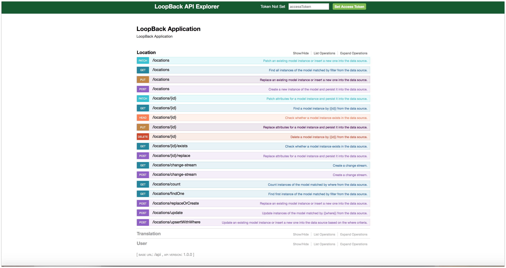

# My Application

I could not get the gradle app to bootstrap so I re-created the whole setup from scratch.

## Server

### Installation instructions

Navigate to server folder

```
npm install
```

```
node server.js
```

Since I couldn't build your application, I created a server side app using LoopBack](http://loopback.io).

I created two data models that match the description of your request. However, since I could not connect to the actual data that exists in your SQL tables, the current API doesn't contain any DATA. Loopback itself has many connectors that can connect to SQL or NoSQL databases, but this takes more time to setup.

This is the exposed REST API.
##REST API


The data is exposed through REST API and based on your assignment request the data has to be secured by authentication. I have made only WRITE DATA (POST) secured by authentication. See image below what happens we try to do POST. An authentication error is thrown.

=================================
| Location |
|===============================|
| id integer (generated) |
| code varchar |
| type varchar |<-------|
| longitude double | |
| latitude double | | parent:  
 | parent integer | | relation between locations
================================= | airport -> city, city -> country  
 | | |
| | |
| --------------------------
|
|
==================================
| Translation |
|================================|
| id integer (generated)|
| location integer |
| language varchar |
| name varchar |
| description varchar |
==================================

## Client

### Installation instructions

Navigate to client folder

```
npm install
```

```
npm start
```


On the client side I am using Angular. Since the server doesn't contain any DATA, I connected it to a public flight API and I simply display it in the home angular component.

NOTE: I hope that what you were trying to test with this assignment is conceptual understanding of programming principles, protocols and concepts. I did this assignment during lunch break on a Friday :).
